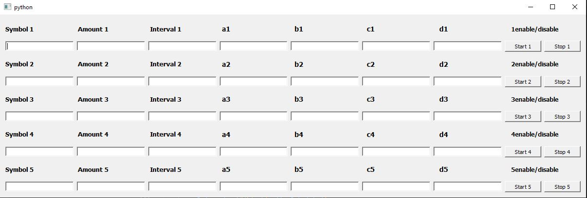

###### #Python    #PyQt5    #Subprocess 
#### Graphical user interface which allows to independently run and stop the Trading_Bot.py file multiple times for different types of cryptocurrencies.
#### You need to
#### 1) write your Trading_Bot.py file
#### 2) write path to Trading_Bot.py file into Multi_trading.py code
#### 3) run Multi_trading.py,

#### 4) fill in the input fields
#### 5) click the "Start" button to run Trading_Bot.py for the currency
#### 6) click the "Stop" button to terminate the trading
